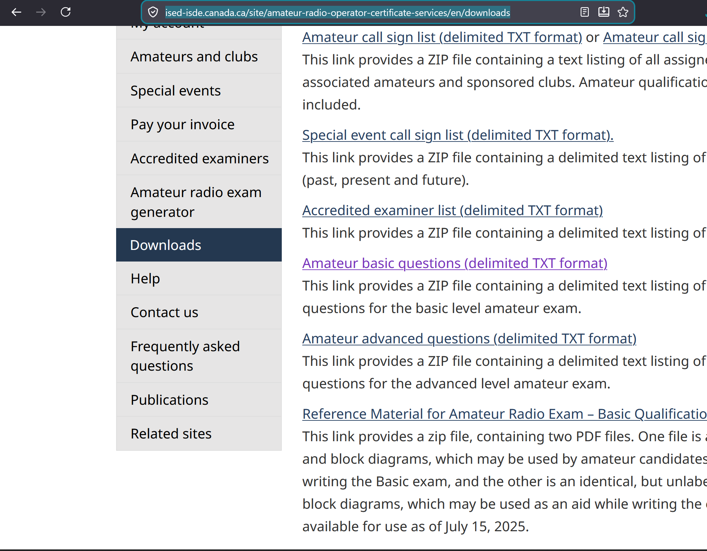

# Where do I download the questions?

## The program will automatically download them upon startup, if you agree to the prompt. You can also download them manually and place them in the expected location

## Manual download steps

From [https://ised-isde.canada.ca/site/amateur-radio-operator-certificate-services/en/downloads](https://ised-isde.canada.ca/site/amateur-radio-operator-certificate-services/en/downloads)

Click on the link in purple:

Extract the downloaded .zip file and copy `amat_basic_quest_delim.txt` to `src/amateurRadioGUI/data` and rename it to `questions.txt`.
